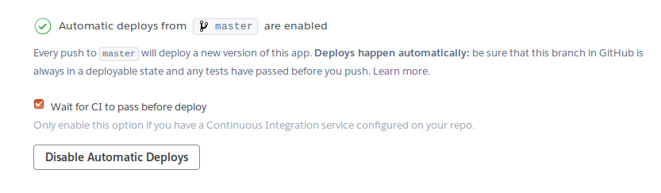
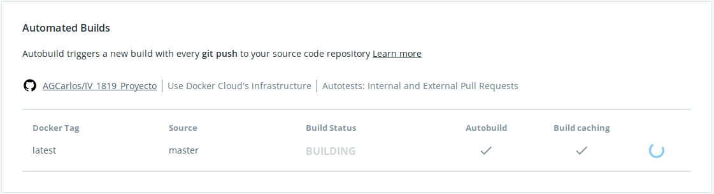
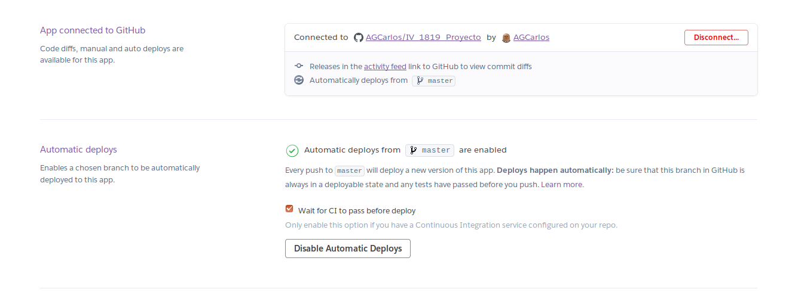

# Documentación del proyecto
---
### Despliegue de la Aplicación en Heroku
Para realizar el despliegue he utilizado la documentación de [Heroku](https://dashboard.heroku.com/apps) y este [tutorial](https://github.com/datademofun/heroku-basic-flask) de un repositorio de Github de _datademofun_.  
Podemos encontrar desplegada la aplicación en :
-  [App en Heroku](https://filecnc.herokuapp.com/) donde encontramos el status
-  [Ejemplo de la aplicación](https://filecnc.herokuapp.com/ejemplo) donde se devuelve un JSON también  

#### Archivos de configuración
- El archivo [**Procfile**](https://github.com/AGCarlos/IV_1819_Proyecto/blob/master/Procfile) se utiliza para especificar a Heroku como iniciar la aplicación web, en este caso con el servidor web gunicorn, de esta manera:  
```
web: gunicorn app:app --log-file=-
```
Especificamos el servidor, la aplicación que vamos a usar y además añadimos opciones para logs.
- Utilizamos el archivo [**runtime**](https://github.com/AGCarlos/IV_1819_Proyecto/blob/master/runtime.txt) para especificarle a Heroku que estamos desplegando una aplicación de Python, añadiendo esto al archivo:  
```
python-3.6.6
```

#### Despliegue automático

En Heroku he configurado los despliegues automáticos para que cada vez que suba los archivos fuentes a github se despliegue en Heroku automáticamente.  



---

### Funcionalidad de la aplicación

La idea de  principal funcionalidad de la aplicación es poder acceder a la ruta /archivos y en esa ruta acceder al archivo en cuestión que nos interese, que nos devolvería un JSON que contiene información del archivo, por ejemplo:  

Accedemos a ``archivos/file1`` y nos devolvería la información acerca del archivo file.    

En este momento están disponibles tres archivos, llamados file1,file2 y file3 en al ruta ``archivos/<archivo>``. Ejemplo: [File1](https://filecnc.herokuapp.com/archivos/file1)

Si los archivos no se visualizaran, se pueden generar entrando en la ruta ``/addFiles``, que los añadirá de nuevo a Redis, debido a que el Add-on para Redis en licencia gratuita de Heroku no mantiene persistencia en algunos casos.  

---

### Despliegue y ejecución con contenedor
##### Docker
Para configurar nuestro contenedor, seguimos la propia [documentacion](https://docs.docker.com/get-started/#docker-concepts), que nos guía en todo el proceso.
##### Archivos de configuración
- **Dockerfile**: Utilizaremos este archivo para automatizar la creación de una imagen que contiene todo lo necesario para la ejecución de nuestra aplicación.

```
# Use an official Python runtime as a parent image
FROM python:2.7-slim

# Set the working directory to /app
WORKDIR /app

# Copy the current directory contents into the container at /app
COPY . /app

# Instalación de todos los requisitos del entorno
RUN pip install --trusted-host pypi.python.org -r requirements.txt

# Abrir puertos, en este caso abrimos el puerto 80
EXPOSE 80

# Variables en tiempo de ejecución
ARG buildtime_variable=default_value

# Variables de entorno
ENV REDIS_URL=$buildtime_variable
ENV NAME World

# Aplicación que se ejecutará al lanzar el contenedor
CMD ["python", "app.py"]
```
Cómo la aplicación utiliza Redis, para conectarse necesita una variable de entorno, que ha sido especificada en el Dockerfile, pero se asigna en tiempo de ejecución de manera que no se vulnere la clave, podemos verlo en el apartado de variables del Dockerfile. Los mismos comentarios del archivo lo explican.
##### Construyendo la imagen

Para construir la imagen utilizamos la siguiente orden:
```
docker build --build-arg buildtime_variable=$REDIS_URL -t nombreContenedor .
```  
Aquí podemos ver como se asigna en tiempo de ejecución la variable para la conexión de Redis.  
Una vez construida, le asignamos un tag, y está lista para subirla a DockerHub:
```
docker tag nombreImagen carlosag/iv_1819_proyecto:tag   
```
Cuando la imagen está construida y tageada, procedemos a subirla a DockerHub:
```
docker push carlosag/iv_1819_proyecto:tag
```  
Para lanzar el contenedor posteriormente no será necesario realizar estos pasos, son pasos ajenos a la ejecución, solo necesario para realizar cambios.  
##### Construcción automatizada
El apartado anterior muestra cómo construir nuestra imagen manualmente, pero he configurado Docker para que cada vez que se suben los archivos fuentes a Github se construya de nuevo:  

  

Esperará a que pasen los test del repositorio antes de construir la imagen.

##### Utilizando la aplicación
Se ha creado y desplegado una imagen de la aplicación en DockerHub, en [este repositorio](https://hub.docker.com/r/carlosag/iv_1819_proyecto/).  
Para poder utilizar la imagen desde cualquier máquina Linux, debemos utilizar esta orden para poder arrancar la aplicación, que utilizará la imagen del repositorio anterior:
```
docker run -p 4000:80 carlosag/iv_1819_proyecto:latest
```
Si no encuentra la imagen localmente, la descargará automáticamente.
Evidentemente es necesario tener instalado Docker.  
Una vez está ejecutando la aplicación podemos acceder a ella desde: ``http://0.0.0.0:4000``.  

Para acceder desde otra máquina Macintosh o Windows, como Docker crea una máquina virtual será necesario obtener su IP para poder acceder, con la orden:
``docker-machine ip ``.

#### Despliegue de la imagen
##### Heroku
Para realizar el despliegue he creado otra app en Heroku, llamada _filecnc-docker_. La vinculamos a nuestro repositorio de Github para que obtenga los archivos necesarios para el despliegue.

   

Los pasos para realizar el despliegue los encontramos en su [documentación](https://devcenter.heroku.com/categories/deploying-with-docker), que describiré brevemente:  

1. Creamos en nuestro proyecto el archivo _heroku.yml_, que indica a Heroku donde está el _Dockerfile_ para crear la imagen y la orden para ejecutar la aplicación.  

```
build:
  docker:
    web: Dockerfile
run:
web: gunicorn app:app --log-file=-
```

2. Nos identificamos en el registro de Heroku:

```
heroku container:login
```

3. Le decimos a heroku que la nueva aplicación va a ser un contenedor:

```
heroku stack:set container -a filecnc-docker
```

4. Subimos la imagen a la nueva aplicación de Heroku:

```
heroku container:push web --app filecnc-docker
```

5. Desplegamos la aplicación:

```
heroku container:release web --app filecnc-docker
```
Después de estos pasos, la imagen está construida y desplegada en la aplicación a través del Dockefile. Podemos encontrarla aquí:
- [App Heroku Docker](https://filecnc-docker.herokuapp.com/)

##### Zeit

Para desplegar en Zeit desde Linux, descargamos de la [web oficial](https://zeit.co/download#now-cli) un ejecutable que ejecutaremos en nuestro repositorio, introducimos nuestros credenciales de Zeit y la aplicación se despliega automáticamente.   
Encontramos el status de la aplicación desplegado en el siguiente enlace:

- Despliegue: [App en Zeit](https://iv1819proyecto-vrynkyytrf.now.sh/status)
