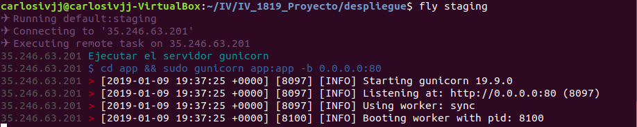

# Documentación del proyecto
---
## Despliegue en Google Cloud
### Configuración inicial
Para trabajar con Google Cloud y Vagrant he utilizado la documentación y tutorial del plugin [_vagrant-google_](https://github.com/mitchellh/vagrant-google), que es un plugin de Vagrant que nos permitirá desplegar nuestra aplicación en Google Cloud.
En esta configuración realizamos:
- La creación de una cuenta de Google Cloud
- La creación del proyecto de Google Cloud:


- La configuración de la API necesaria (Compute Engine), que nos permite crear VM IaaS:


- La obtención de todos los credenciales necesarios para poder controlar las máquinas desde Vagrant.

 - En este paso nos descargamos un archivos con los credenciales necesarios para el despliegue con Vagrant

Para desplegar y crear desde cero nuestra aplicación en una máquina de tipo IaaS, vamos a usar [Vagrant](https://www.vagrantup.com/), [Ansible](https://www.ansible.com/) y [Flightplan](https://github.com/pstadler/flightplan).

### Orquestamiento con Vagrant
Con Vagrant vamos a crear y levantar las máquinas virtuales en Google Cloud, utilizando como base el archivo **Vagrantfile** que nos proporciona la documetanción del plugin, que vamos a personalizar para nuestro proyecto:
```
Vagrant.configure("2") do |config|
  config.vm.box = "google/gce" # Box de Google CE

  config.vm.provider :google do |google, override|

    # Configuración del proyecto
    google.google_project_id = ENV['PROJECT_ID'] # ID del proyecto
    google.google_client_email = ENV['CLIENT_EMAIL'] # Email de cliente
    google.google_json_key_location = ENV['JSON_KEY_LOCATION'] # Credenciales

    # Configuración de la instancia
    google.image_family = 'ubuntu-1604-lts' # Distribución a usar
    google.machine_type = 'n1-standard-1' # Tipo de máquina
    google.disk_size = '10' # Tamaño del disco
    google.disk_name = 'disk-iv' # Nombre del disco
    google.disk_type = 'pd-standard' # Tipo del disco
    google.metadata = {'REDIS_URL' => ENV['REDIS_URL']} # Variables de entorno
    google.external_ip = '35.246.63.201' # IP externa de la máquina
    google.tags = ['http-server'] # Activar conexiones http
    google.name = 'filecnc' # Nombre para la instancia
    google.zone = "europe-west2-a" # Zona

    # Configuración de SSH
    override.ssh.username = "carlosivjj" # Usuario para SSH
    override.ssh.private_key_path = "~/.ssh/id_rsa" # Ruta a las claves SSH
  end

  config.vm.provision :ansible do |ansible|
      ansible.playbook = "provision/playbook.yml"
  end

end
```
En la primera parte del archivo, indicamos dos importantes cosas:
- Primero indicamos en la primera línea la **versión** de configuración 2, ya que nuestra versión de Vagrant es la 2.0.3
- Después tenemos que indicar que [box de Vagrant](https://app.vagrantup.com/boxes/search) vamos a usar, que es la imagen base que se usará para crear la máquina,  en nuestro caso, **google/gce** es la [dummy-box de Google Compute Engine](https://app.vagrantup.com/google/boxes/gce).

Como configuración del proveedor vamos a establecer lo siguiente, con variables de entorno para no vulnerar nuestros credenciales:
- **google_project_id**: El ID de nuestro proyecto en Google Cloud
- **google_client_email**: Un email de cliente que nos proporcionan
- **google_json_key_location**: Un archivo que contiene todos nuestros credenciales, que estará almacenado en un directorio privado fuera de nuestro proyecto

Además, sin variables de entorno indicamos:
- **image_family**: La familia de la imagen que queremos usar, se usará en la máquina la última versión de esta, en nuestro caso será la versión de Ubuntu (16.04-lts), ya que la última versión 18 tiene problemas con Ansible, obtenida de la [lista de versiones](https://cloud.google.com/compute/docs/images)
- **machine_type**: El tipo de máquina que queremos utilizar, para nuestra aplicación es suficiente con _n1-standard-1_, ya que esta equipada con una vCPU y 3.75 GB de memoria, con un coste de $0.0475 por hora, obtenida de la [lista de máquinas](https://cloud.google.com/compute/docs/machine-types) y [precios](https://cloud.google.com/compute/pricing?hl=es)
- **disk_size, disk_name y disk_type**: El tamaño del disco, con 10 GB será suficiente, el nombre del disco y el tipo de disco, HDD o SSD, elegimos en nuestro caso HDD.
- **metadata**: Con esta opción podemos introducir pares de clave valor a nuestra instancia, en nuestro caso añadiremos la variable de entorno que necesita REDIS para funcionar.
- **external_ip**: Establecemos la IP externa a la que nos conectaremos.
- **tags**: Con esta opción activamos el servicio HTTP para poder conectarnos en el puerto 80.
- **name**: El nombre que le vamos a dar a la instancia.
- **zone**: Como por defecto la zona viene en US, la establecemos en Europa.

Como configuración de SSH indicamos:
- **ssh.username**: El usuario que podrá conectarse por SSH
- **ssh.private_key_path**: El path a nuestras claves SSH

Todas estas opciones de configuración pueden encontrase en el [apartado de configuración ](https://github.com/mitchellh/vagrant-google#configuration) de la documentación del plugin.
Por último, el apartado de provisionamiento se explica en el siguiente punto.

#### Provisionamiento con Ansible
<<<<<<< HEAD
 Por último en el Vagrantfile tenemos que indicar con que vamos a provisionar, en este caso Ansible, con el archivo de configuración **playbook.yml**, que es el archivo que vamos a utilizar para instalar todas la dependencias necesarias para que nuestra aplicación funcione, que es el siguiente:
=======
Podemos aprender como utilizar ansible en el siguiente [enlace](https://docs.ansible.com/ansible/latest/user_guide/playbooks_intro.html#basics
) y en la misma [documentación de Vagrant](https://www.vagrantup.com/docs/provisioning/ansible_intro.html), donde nos indica su sintáxis y como se añade al Vagrantfile. Por último en el Vagrantfile indicamos el provisionamiento indicando el directorio donde se encuentra el **playbook.yml**, que es el archivo que vamos a utilizar para instalar todas la dependencias necesarias para que nuestra aplicación funcione, que es el siguiente:
>>>>>>> c9dec6d62feacb4d958a6384da0fe7864f881cc9
```
- hosts: all # Hosts permitidos
  remote_user: vagrant # Usuario de la máquina
  become: yes # Permitimos el uso de sudo

  # Tareas a realizar
  tasks:
  - name: Actualizar máquina
    command: sudo apt-get update

  - name: Instalar Git
    command: sudo apt-get install -y git

  - name: Instalar pip3
    command: sudo apt-get -y install python3-pip

  - name: Clonar repositorio de GitHub
    git: repo=https://github.com/AGCarlos/IV_1819_Proyecto.git  dest=app/

  - name: Instalar los requisitos del proyecto
    command: pip3 install -r app/requirements.txt
```
<<<<<<< HEAD
Vemos que instalamos Git, Pip3 y además realizamos actualización de la máquina y clonamos el repositorio de nuestra aplicación incluyendo la instalación todos sus requisitos.

Con estos dos archivos, podemos realizar la creación de la máquina y despliegue con los siguientes comandos:
- Con ``vagrant up`` vamos a crear la máquina y provisionarla con las dependencias que hemos especificado, como vemos en la siguiente captura:
=======
Vemos que instalamos:
- Git
- Pip3

Utilizamos _become : yes_ para poder utilizar órdenes como sudo entre otras.

Y además realizamos actualización de la máquina y clonamos el repositorio de nuestra aplicación incluyendo la instalación todos sus requisitos. Con estos dos archivos, podemos realizar la creación de la máquina y despliegue con los siguientes comandos:
- Con ``vagrant up --provider=google`` vamos a crear la máquina y provisionarla con las dependencias que hemos especificado, como vemos en la siguiente captura:
>>>>>>> c9dec6d62feacb4d958a6384da0fe7864f881cc9


Podemos ver como toda la configuración que hemos establecido en el Vagrantfile se muestra en la anterior captura al levantar la máquina. Una vez hemos realizado esto, podemos realizar un ping a la IP de la máquina y comprobar que está funcionando.

Para la creación del playbook se utiliza la propia [documetanción de Ansible](https://docs.ansible.com/ansible/latest/user_guide/playbooks_intro.html#basics) y la [ayuda de provisionamiento de Vagrant](https://www.vagrantup.com/docs/provisioning/ansible.html).
#### Despliegue con Flightplan
Por último, para desplegar nuestra aplicación en la máquina y poner a funcionar el servidor vamos a utilizar [Flightplan](https://github.com/pstadler/flightplan), que nos permite ejecutar órdenes en el terminal bash de nuestra máquina a través de SSH, que he definido en el siguiente archivo [**flightplan.js**](https://github.com/AGCarlos/IV_1819_Proyecto/blob/master/despliegue/flightplan.js):
```
// flightplan.js
var plan = require('flightplan');

// configuration
plan.target('staging', {
  host: '35.246.63.201 ',
  username: 'carlosivjj',
  agent: process.env.SSH_AUTH_SOCK
});

// run commands on the target's remote hosts
plan.remote(function(remote) {
    remote.log('Ejecutar el servidor gunicorn');
    var folder = 'app';
    remote.exec('cd ' + folder + ' && sudo gunicorn app:app -b 0.0.0.0:80');
});
```
En este archivo definimos varias variables:
- **plan**: nos permite usar todas las funciones de Flightplan

Asociadas al plan:
- **host**: El host al que vamos a conectarnos y mandar las órdenes
- **username**: El usuario al que conectarnos en el host

Y definimos una función para desplegar nuestra aplicación:
```
plan.remote(function(remote) {
    remote.log('Ejecutar el servidor gunicorn');
    var folder = 'app';
    remote.exec('cd ' + folder + ' && sudo gunicorn app:app -b 0.0.0.0:80');
});
```
- Con _remote_ especificamos que las órdenes se van a ejecutar en la máquina remota
- Usamos la _funcion log_ para imprimir mensajes por consola y la _función exec_ para ejecutar nuestras órdenes

Para iniciar nuestra aplicación realizamos ``fly staging``, que va a utilizar por defecto el archivo _flightplan.js_.



En la anterior captura podemos ver como se utiliza ese archivo flightplan.js para iniciar el servidor.

Ya podemos acceder a la aplicación a través de la IP: **35.246.63.201**.

Para aprender a usar Flightplan he usado la propia documentación:
- [Documentación](https://github.com/pstadler/flightplan)
- Algún foro para resolver problemas (orden cd no funcionando) [Foro](https://github.com/pstadler/flightplan/issues/2)
