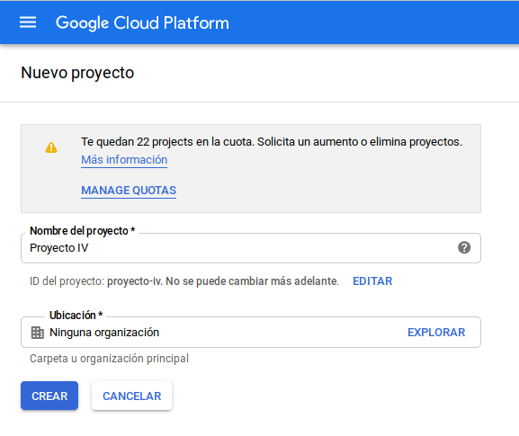
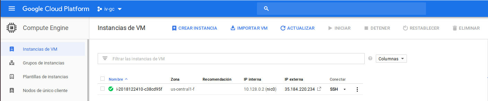
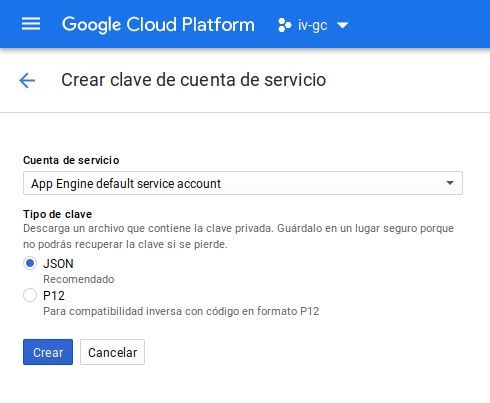
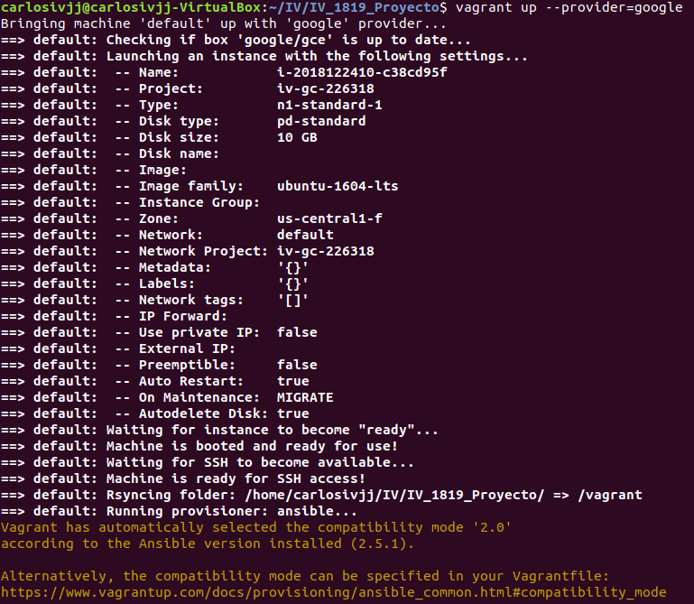
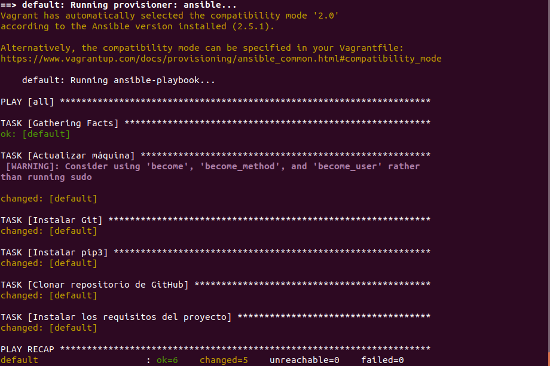
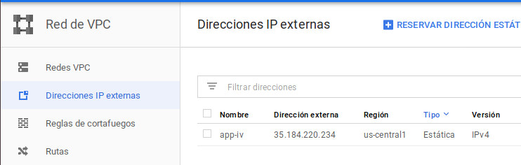
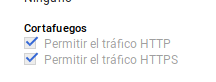

# Documentación del proyecto
---
## Despliegue en Google Cloud
### Configuración inicial
Para trabajar con Google Cloud y Vagrant he utilizado la documentación y tutorial del plugin [_vagrant-google_](https://github.com/mitchellh/vagrant-google), que es un plugin de Vagrant que nos permitirá desplegar nuestra aplicación en Google Cloud.  
En esta configuración realizamos:
- La creación de una cuenta de Google Cloud
- La creación del proyecto de Google Cloud:


- La configuración de la API necesaria (Compute Engine), que nos permite crear VM IaaS:  


- La obtención de todos los credenciales necesarios para poder controlar las máquinas desde Vagrant.  
  
 - En este paso nos descargamos un archivos con los credenciales necesarios para el despliegue con Vagrant

Para desplegar y crear desde cero nuestra aplicación en una máquina de tipo IaaS, vamos a usar [Vagrant](https://www.vagrantup.com/), [Ansible](https://www.ansible.com/) y Fabric.

### Orquestamiento con Vagrant
Con Vagrant vamos a crear y levantar las máquinas virtuales en Google Cloud utilizando el siguiente archivo **Vagrantfile**:
```
Vagrant.configure("2") do |config|
  config.vm.box = "google/gce"

  config.vm.provider :google do |google, override|
    google.google_project_id = ENV['PROJECT_ID']
    google.google_client_email = ENV['CLIENT_EMAIL']
    google.google_json_key_location = ENV['JSON_KEY_LOCATION']

    google.image_family = 'ubuntu-1604-lts'

    override.ssh.username = "carlosivjj"
    override.ssh.private_key_path = "~/.ssh/id_rsa"
  end

  config.vm.provision :ansible do |ansible|
      ansible.playbook = "provision/playbook.yml"
  end

end
```
Donde vamos a indicar, con variables de entorno para no vulnerar nuestros credenciales:
- El ID de nuestro proyecto en Google Cloud
- Un email de cliente que nos proporcionan
- Un archivo que contiene todos nuestros credenciales, que estará almacenado en un directorio secreto fuera de nuestro proyecto

Además, sin variables de entorno indicamos:
- La distribución que queremos utilizar
- El usuario que podrá conectarse por SSH
- El path a las claves SSH

##### Provisionamiento con Ansible
Podemos aprender como utilizar ansible en el siguiente [enlace](https://docs.ansible.com/ansible/latest/user_guide/playbooks_intro.html#basics
). Por último en el Vagrantfile indicamos el provisionamiento indicando el directorio donde se encuentra el **playbook.yml**, que es el archivo que vamos a utilizar para instalar todas la dependencias necesarias para que nuestra aplicación funcione, que es el siguiente:
```
- hosts: all
  remote_user: vagrant
  become: yes

  tasks:
  - name: Actualizar máquina
    command: sudo apt-get update

  - name: Agregar repo python 3.6
    become: true
    apt_repository: repo=ppa:deadsnakes/ppa state=present

  - name: Instalar Python 3.6
    become: true
    apt: pkg=python3.6 state=present

  - name: Instalar Git
    command: sudo apt-get install -y git

  - name: Instalar pip3
    command: sudo apt-get -y install python3-pip

  - name: Clonar repossitorio de GitHub
    git: repo=https://github.com/AGCarlos/IV_1819_Proyecto.git  dest=app/

  - name: Instalar los requisitos del proyecto
    command: pip3 install -r app/requirements.txt

```
Vemos que instalamos:
- Python (previamente añadimos el repo para poder descargarlo)
- Git
- Pip3  

Y además realizamos actualización de la máquina y clonamos el repositorio de nuestra aplicación incluyendo la instalación todos sus requisitos.  

Con estos dos archivos, podemos realizar la creación de la máquina y despliegue con los siguientes comandos:
- Con ``vagrant up --provider=google`` vamos a crear la máquina y provisionarla con las dependencias que hemos especificado, como vemos en la siguiente captura:


  

Una vez hemos realizado esto, podemos realizar un ping a la IP de la máquina y comprobar que está funcionando.
##### Despliegue con Fabric
Por último, para desplegar nuestra aplicación en la máquina y poner a funcionar el servidor vamos a utilizar Fabric, que nos permite definir ciertas funciones que luego se ejecutarán en nuestra máquina, que he definido en el siguiente archivo **fabfile.py**:
```
# Import Fabric's API module
from fabric.api import *
import os

# Elimina el repositorio si ya estaba creado y lo vuelve a clonar para actualizarlo
def CrearApp():

    run('sudo rm -rf app')
    run('git clone https://github.com/AGCarlos/IV_1819_Proyecto.git app')
    run('pip3 install -r app/requirements.txt')

# Inicia la app en la maquina
def IniciarApp():

    run('cd app/ && sudo gunicorn app:app -b 0.0.0.0:80')

```  
En este archivo tenemos dos funciones:
- **CrearApp**: Elimina el repositoro y lo vuelve a descargar para obtener cualquier actualización del mismo
- **IniciarApp**: Iniciar el servidor gunicorn para servir nuestra app en el puerto 80 a través de la siguiente IP: 35.184.220.234  

Para iniciar nuestra aplicación realizamos:  
```
fab -f fabfile.py -H carlosivjj@35.184.220.234 IniciarApp
```
Ya podemos acceder a la aplicación a través de la IP: **35.184.220.234**
##### Configuraciones adicionales necesarias
Para el correcto funcionamiento de la aplicación he tenido que realizar los siguientes ajustes.
###### IP estática
Por defecto Google Cloud asigna a la máquina virtual una IP efímera, por lo que he tenido que configurar una IP estática en el apartado de IP externas:

  

###### Abrir puerto 80
Para poder servir la aplicación en el puerto 80 tenemos que permitir el tráfico HTTP en las opciones de nuestra máquina virtual:

  
